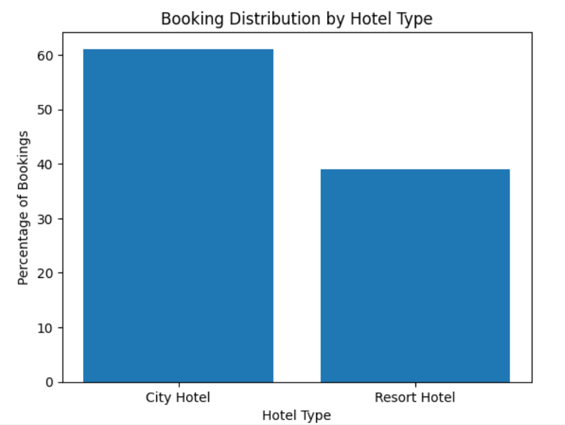
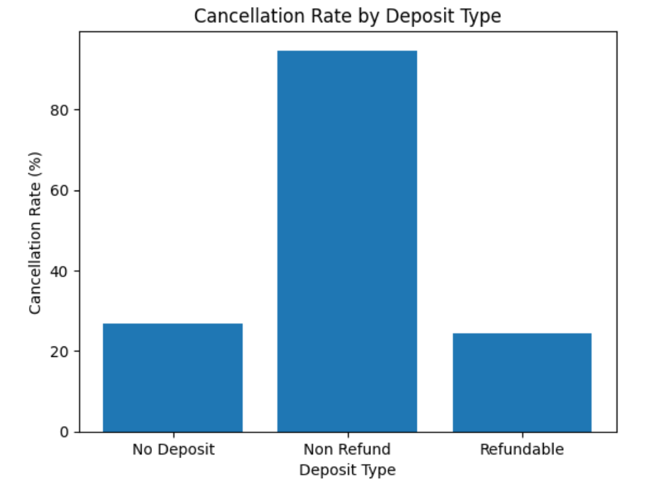
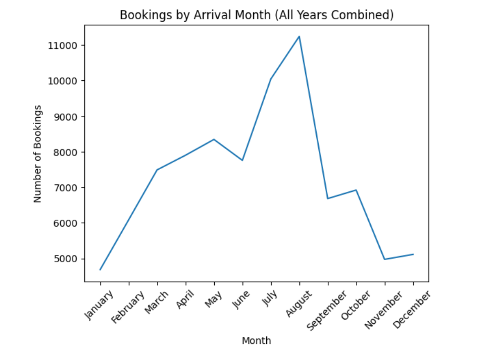

# Hotel Booking Analysis

## Project Overview
This project explores hotel booking data to understand booking patterns, customer behavior, and factors associated with booking cancellations. The analysis was performed using Python and Pandas, with Matplotlib used for data visualization.

## Project Objectives
- Understand the distribution of bookings across hotel types.
- Analyze booking cancellation rates.
- Explore how lead time, market segment, deposit type, and previous cancellations relate to cancellations.
- Examine booking patterns across arrival months.
- Present findings through visualizations and business insights.

## Dataset
- **Source:** [Hotel Booking Demand Dataset – Kaggle](https://www.kaggle.com/datasets/jessemostipak/hotel-booking-demand)
- The dataset contains hotel booking records with information about hotel type, booking status, arrival dates, guest details, market segment, deposit type, and other booking characteristics.

The dataset is not included in this repository. Download it from the source above and place `hotel_bookings.csv` in the project folder before running the notebook.

## Tools and Libraries
- Python
- Pandas
- Matplotlib
- Jupyter Notebook

## Data Cleaning
The data preparation process included:
- Identifying and removing exact duplicate rows.
- Handling missing values in selected columns.
- Removing the `company` column because a large proportion of its values were missing.
- Creating a `total_guests` column.
- Removing records with zero recorded guests.
- Removing a record with a negative average daily rate (ADR).
- Creating a `total_nights` column.

## Analysis
The project investigates 11 questions, including:
- How bookings are distributed between City Hotels and Resort Hotels.
- What percentage of bookings are cancelled.
- Whether lead time differs between cancelled and non-cancelled bookings.
- How length of stay varies by hotel type.
- Which countries contribute the most bookings.
- Whether repeated guests are less likely to cancel.
- How cancellation rates vary by market segment, deposit type, previous cancellations, and hotel type.
- Which arrival months have the highest number of bookings.

## Key Findings
- Approximately 27.5% of bookings were cancelled.
- Cancelled bookings had a higher average lead time than non-cancelled bookings.
- The Online TA market segment had a relatively high cancellation rate.
- Bookings with a Non Refund deposit type had a high cancellation rate.
- Guests with previous cancellations had a higher cancellation rate in the analyzed data.
- City Hotels had a higher cancellation rate than Resort Hotels.
- August had the highest number of bookings and January the lowest across the combined dataset.

These findings describe associations in the analyzed data and do not establish causation.

## How to Run the Project
1. Download or clone this repository.
2. Download the dataset from Kaggle and place `hotel_bookings.csv` in the project folder.
3. Open `Hotel_Booking_Analysis.ipynb` in Jupyter Notebook.
4. Run the notebook cells from top to bottom.

## Project Files
- `Hotel_Booking_Analysis.ipynb` – data cleaning, exploratory analysis, visualizations, and insights.
- `README.md` – project documentation.

## Future Improvements
- Compare booking patterns month by month across individual years.
- Explore additional factors associated with cancellations.
- Develop an interactive dashboard for hotel booking analysis.

## Visualizations

### 1. Booking Distribution by Hotel Type

### 2. Cancellation Rate by Deposit Type

### 3. Bookings by Arrival Month

